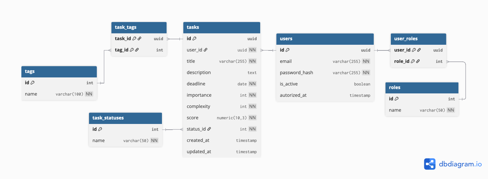

# 🚀 Smart Task Manager (MVP)

> Минималистичный fullstack-проект для приоритизации задач  
> Архитектура: **React + FastAPI (REST)** > Паттерн: **Resilient UI**

---

## 🧠 О проекте

**Smart Task Manager** — это MVP-приложение для управления задачами  
с автоматическим расчетом приоритета на основе:

- 📅 Срочности (deadline)
- ⭐ Важности (importance)
- ⚙️ Сложности (complexity / story points)

Проект разработан командой из 2 человек.

**Роль:** Frontend Developer (React + Vite)

---

## 🏗 Архитектура

### 🎨 Frontend
- ⚛️ React (Vite)
- 🎨 CSS Modules (Mobile First)
- 🌐 REST API интеграция
- 🔁 Mock Service Layer (Fallback логика)
- 🌍 Deploy: Netlify

### 🧠 Backend
- 🐍 Python
- ⚡ FastAPI
- 🔌 REST API
- 🧮 Алгоритм расчета приоритета
- ☁️ Deploy: Render

---

## 🗂️ ER-модель



## 🧮 Формула расчета приоритета

Сервер рассчитывает `score` по формуле:

```math
score = (importance \times urgency\_coefficient) / complexity
```

Где коэффициент срочности:

| Дней до дедлайна | Коэффициент |
| :--- | :--- |
| ≤ 1 день | 3.0 |
| ≤ 7 дней | 1.5 |
| > 7 дней | 1.0 |

---

## 🌐 Production URLs

### 🔗 Backend (Render)
https://task-manager-mvp.onrender.com

* **Health check:** `/health`
* **Swagger docs:** `/docs`

---

## ⚙️ Переменные окружения (Frontend)

Создать файл: `frontend/.env`

Содержимое:
```env
VITE_API_URL=[https://task-manager-mvp.onrender.com](https://task-manager-mvp.onrender.com)
```

В коде используется:
```javascript
const API_URL = import.meta.env.VITE_API_URL;
```

---

## 💡 Resilient UI (устойчивый интерфейс)

Если **Backend недоступен**:

1. Приложение автоматически переключается в **Demo Mode**.
2. Используется локальный **Mock Service Layer**.
3. Логика сортировки продублирована на клиенте.
4. Пользователь не теряет функциональность.

---

## 🧪 Локальный запуск

### Backend

```bash
cd backend
python -m venv venv
source venv/bin/activate  # Mac/Linux
# Windows: venv\Scripts\activate
pip install -r requirements.txt
uvicorn main:app --reload
```
Откроется: `http://localhost:8000/docs`

### Frontend

```bash
cd frontend
npm install
npm run dev
```
Откроется: `http://localhost:5173`

---

## 🛠 Стек технологий & 📦 Структура проекта

```text
task-manager-mvp/
│
├── backend/
│   ├── main.py
│   └── requirements.txt
│
├── frontend/
│   ├── src/
│   ├── package.json
│   └── .env
│
└── README.md
```

---

## 📈 Что реализовано

- ✅ CRUD задач
- ✅ Серверный расчет приоритета
- ✅ Сортировка по score
- ✅ Fallback режим (Mock Layer)
- ✅ Fullstack деплой (Render + Netlify)
- ✅ Environment configuration
- ✅ Production API

---

## 🎯 Итог

Проект демонстрирует:
- Архитектуру fullstack-приложения
- Интеграцию React + FastAPI
- Работу с REST API
- Продакшн-деплой
- Устойчивый UI-подход
- Грамотное разделение логики клиента и сервера

---

## 👨‍💻 Разработчики

**Frontend Developer (React + Vite)**
**Fullstack Integration**

2026
