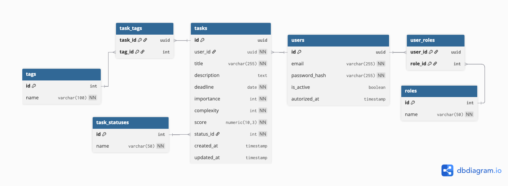

# 🚀 Smart Task Manager (MVP)

Fullstack-приложение для управления задачами с автоматической приоритизацией.
Стек: **React (Vite) + FastAPI + PostgreSQL + Docker + Nginx**

---

## 🧠 О проекте

Приложение вычисляет приоритет задач на основе:

* важности
* сложности
* дедлайна

Каждый пользователь работает в изолированном пространстве (JWT-auth).

---

## 🛠 Стек технологий

### Frontend

* React 18 (Vite)
* Context API + Custom Hooks
* JWT Authentication

### Backend

* FastAPI (Python 3.11)
* PostgreSQL (SQLAlchemy)
* Bcrypt + PyJWT

### DevOps

* Docker & Docker Compose
* Nginx (reverse proxy)

---

## 🧮 Алгоритм приоритизации

```
score = (importance * urgency) / complexity
```

**Urgency:**

* 🔥 < 1 day → 3.0
* ⚡ < 7 days → 1.5
* 🗓 > 7 days → 1.0

---

## 🐳 Запуск через Docker (рекомендуется)

```bash
docker-compose up -d --build
```

После запуска:

* Frontend → http://localhost
* Backend → http://localhost/api
* Swagger → http://localhost/api/docs

---

## 🧪 Локальный запуск (без Docker)

### Backend

```bash
cd backend
python -m venv venv
source venv/bin/activate
pip install -r requirements.txt
uvicorn main:app --reload
```

### Frontend

```bash
cd frontend
npm install
npm run dev
```

---

## 🌐 Деплой

* Self-hosted (Docker + Nginx): https://task-manager-higzi.ru

---

## 🗂 Архитектура



---

## 👨‍💻 Команда

| *Никнейм*  | *Должность* |
| ------------- |:-------------:|
| artemkill0 (Артём)     | Тим лид/архитектор     |
| ExS1Te9780 (Даниил)      | Backend    |
| higzi (Андрей)     | Frontend + Integration + DevOps    |

*Команда развития:*

| *Никнейм*  | *Должность* |
| ------------- |:-------------:|
| motofuga (Никита)     | QA     |
| Tusnane (Анатолий)      | Product / Analyst / Documentation    |
| (Кристина)    | ux/ui (поддержка идеи дизайнов)    |


---

## 📌 Статус

🚧 MVP в разработке

2026
